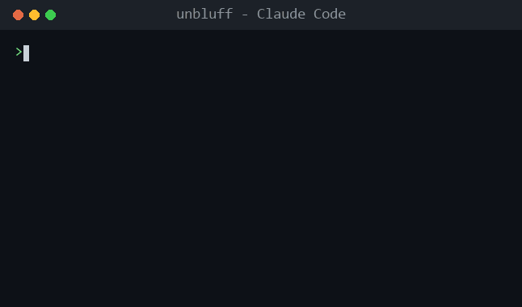
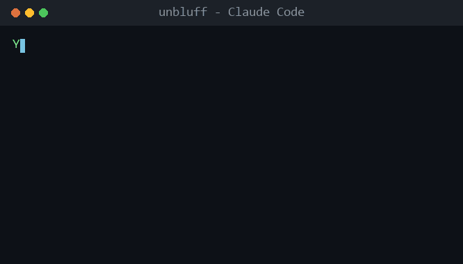
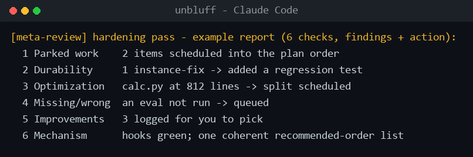
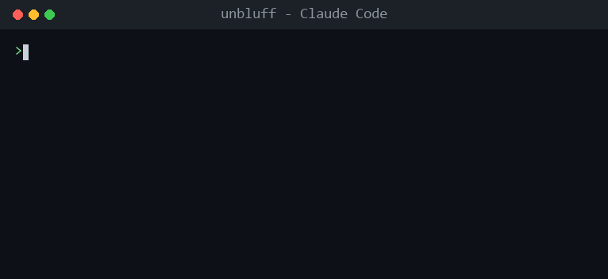
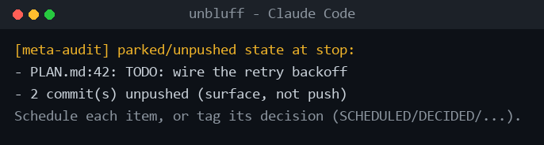
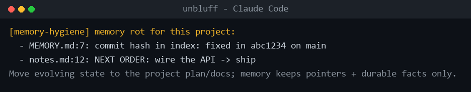
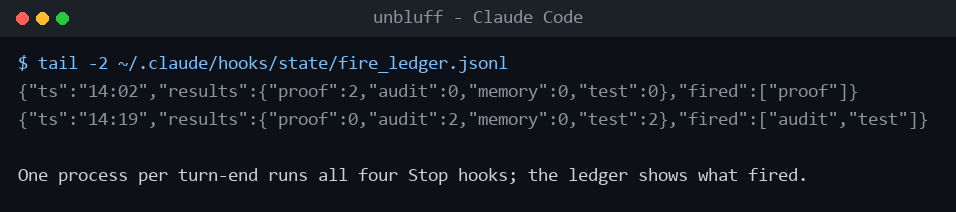

# unbluff

**Keep Claude Code honest.** A suite of fail-silent hooks and a reasoning skill that make the agent back up its own work instead of cutting corners - across your prompts, its claims, your tests, parked work, and memory. Mechanical, `$0`, zero-latency.

*An independent, unofficial community project. Not affiliated with or endorsed by Anthropic. Designed and directed by the author, implemented with AI assistance.*

[](https://github.com/AmmarBibi/unbluff/actions/workflows/selftest.yml)
[](LICENSE)
[](https://www.python.org/)
[-brightgreen.svg)](#design-principles)
[](#design-principles)

Every piece is mechanical (no model calls, no latency, no network), fails silent, and ships with its own self-test. Install it and forget it.

## What's inside

*The demos below are animated reconstructions generated by [`scripts/make_demos.py`](scripts/make_demos.py) - the hook output text is the real thing, not a mock-up.*

### show-your-proof · Stop
Catches an *"it works" / "tests pass"* claim made with **zero tool runs** and nudges Claude to actually verify or soften it. Fires at most once per session.



### rate_prompt · UserPromptSubmit
Rates every prompt **X/10** and rewrites it to a sharper version inline before Claude acts - with **no model call, zero latency, $0**. Skips one-word replies; honors a "verbatim" escape hatch.



### meta-review · skill
A deliberate reasoning pass you run at milestones: it audits for parked work, instance-only fixes lacking a durable mechanism, optimization gaps, and what's silently missing - then schedules or fixes each. The judgment the hooks can't do.



### fast_test_on_stop · Stop
When source changed, runs your fast tests at turn-end and feeds any failure straight back to Claude - so a "green" claim is an actually-green claim.



### meta_audit_on_stop · Stop
Surfaces parked / deferred / TODO work that carries no decision tag, plus unpushed commits - so nothing quietly hides at the end of a turn.



### memory_hygiene_guard · Stop
Flags rot in Claude Code auto-memory: index bloat, stale commit hashes, and evolving state that belongs in your plan, not long-term memory.



### hook_health_check · SessionStart
At session start, verifies every configured hook resolves and weekly-runs each hook's self-test. A broken safety net is worse than none.


### stop_dispatcher · Stop
Runs all four Stop hooks in **one** process per turn (not four) and logs a fire-ledger, so you can see exactly what fired and when.



## How this compares

| Project | What it is for |
|---------|----------------|
| [claude-code-hooks-mastery](https://github.com/disler/claude-code-hooks-mastery) | Learn every hook event (a comprehensive reference) |
| [claude-code-prompt-improver](https://github.com/severity1/claude-code-prompt-improver) | A model-call prompt rewrite (adds latency, worth it for many) |
| **unbluff** | Mechanical, `$0`, zero-latency self-verification you install and forget |

The wedge: everything here makes **no model calls**, adds **no latency**, sends **nothing over the network**, and fails silent.

## Install

```bash
git clone https://github.com/AmmarBibi/unbluff.git
cd unbluff

python install.py --dry-run   # preview exactly what will change
python install.py             # apply (backs up ~/.claude/settings.json first, writes atomically)
```

Then restart Claude Code (or start a new session). To reverse everything:

```bash
python install.py --uninstall
```

Pick a subset - the install is not all-or-nothing:

```bash
python install.py --only stop_dispatcher     # just the Stop-time hooks
python install.py --without rate_prompt      # everything except the prompt rater
```

The installer references the hooks **in place**, so `git pull` updates them with no re-install.

### Wire a single hook by hand

Prefer to wire one hook and nothing else? Add this to `~/.claude/settings.json` (absolute path to your clone):

```json
{
  "hooks": {
    "Stop": [
      {
        "matcher": "*",
        "hooks": [
          { "type": "command", "command": "python \"/ABSOLUTE/PATH/TO/unbluff/hooks/show_your_proof.py\"" }
        ]
      }
    ]
  }
}
```

Each hook runs standalone - none needs the dispatcher. See [`examples/settings.json`](examples/settings.json) for the full wiring.

## Per-project fast tests

`fast_test_on_stop` auto-detects `pytest` or a `package.json` test script. To point it at a specific fast subset, drop a `.claude/fast-test.cmd` in your project:

```text
# first non-comment line is the command; optional timeout/debounce (seconds)
timeout=120
debounce=600
pytest -x -q tests/unit
```

## Design principles

Every hook in this suite:

- **Fails silent.** Any unexpected error exits `0`. A broken hook can never block or crash your session.
- **Is mechanical.** Regex, counting, and file-existence checks only - no LLM calls, no network, no telemetry.
- **Is stdlib-only.** No dependencies. Python 3.8+.
- **Fires at most once per session** (where relevant) and is conservative - it would rather stay silent than nag.
- **Self-tests.** Run `python hooks/<name>.py --selftest`; fixtures never touch real state.

```bash
# verify the whole suite (this is exactly what CI runs)
python run_selftests.py
```

## Known limitations

Honesty beats surprise:

- **`show_your_proof` keys off phrases, not truth.** It matches success-claim wording, so it can occasionally nudge on a non-code message that happens to say "it works." It fires once per session, so the worst case is a single stray line - a heuristic, not an oracle.
- **`rate_prompt` adds a rating block to every substantive reply.** Some love the discipline; some find it noisy - hence the off-switch (`CLAUDE_RATE_PROMPTS=off`) and `--without rate_prompt`.
- **`memory_hygiene_guard` is opinionated.** It assumes the Claude Code auto-memory convention (`~/.claude/projects/<project>/memory`). If you do not use auto-memory, it stays silent.

## Requirements

- [Claude Code](https://code.claude.com/) with hooks enabled.
- Python 3.8+ on your PATH (the installer embeds the interpreter it was run with).
- CI runs the self-tests on Linux, macOS, and Windows across Python 3.8-3.12.

## FAQ

**Is this affiliated with Anthropic?** No. It is an independent, unofficial community project that targets Claude Code's public hooks interface.

**Did you write this by hand?** It was designed and directed by me and implemented with AI assistance, like most tooling people ship in 2026. The design decisions - the fail-silent invariants, the once-per-session guards, the test fixtures - are the point.

**Will it slow Claude down?** No meaningful latency. `rate_prompt` makes no model call. The Stop hooks run once at turn-end in a single process; `fast_test_on_stop` only runs your tests when source changed and is debounced.

## Contributing

See [CONTRIBUTING.md](CONTRIBUTING.md). The one rule that matters: keep the hooks fail-silent, mechanical, stdlib-only, and self-testing.

## License

[MIT](LICENSE) (c) 2026 [AmmarBibi](https://github.com/AmmarBibi)

If unbluff saved you from a confidently-wrong "it works," a star is appreciated.
