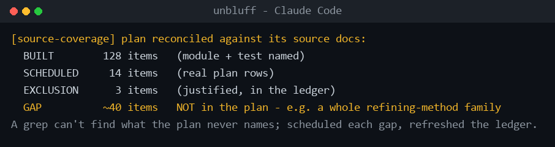
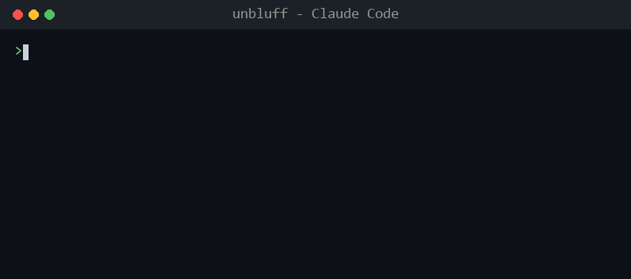
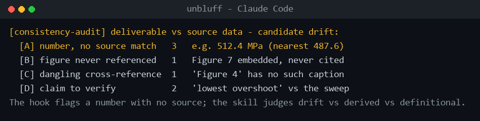

# unbluff

*Mechanical self-verification hooks for [Claude Code](https://code.claude.com/).*

**Keep Claude Code honest.** A suite of fail-silent hooks and a reasoning skill that make the agent back up its own work instead of cutting corners - across your prompts, its claims, your tests, parked work, and memory. No third-party dependencies, no network, no telemetry.

*An independent, unofficial community project. Not affiliated with or endorsed by Anthropic. Designed and directed by the author, implemented with AI assistance.*

[](https://github.com/AmmarBibi/unbluff/actions/workflows/selftest.yml)
[](LICENSE)
[](https://www.python.org/)
[-brightgreen.svg)](#design-principles)
[](#design-principles)

## Quickstart

Only requirement: **Python 3.8+ on your PATH** (no `pip install` - stdlib only).

```bash
git clone https://github.com/AmmarBibi/unbluff.git
cd unbluff
```

Preview exactly what it will change (writes nothing):

```bash
python install.py --dry-run
```

Then install it (backs up your `settings.json` first; `python install.py --uninstall` reverses it):

```bash
python install.py
```

> **Keep the clone somewhere permanent.** The installer points `settings.json` at these files *in place* (so `git pull` updates them). If you later move or delete the folder, run `python install.py --uninstall` first.

`python install.py` enables all thirteen pieces, including `rate_prompt`, which adds an X/10 rating to *every* reply. Not for you? `python install.py --without rate_prompt` (or `--only …`). It's off-switchable any time with `CLAUDE_RATE_PROMPTS=off`.

## What's inside

*The demos below are animated reconstructions generated by [`scripts/make_demos.py`](scripts/make_demos.py). Hook output is shown verbatim; the `rate_prompt`, `meta-review`, and `consistency-audit` demos illustrate a representative result (the model's rating and the skill's report naturally vary).*

### show_your_proof · Stop
Catches a success claim ("it works", "tests pass") made with zero tool runs, and nudges the agent to actually verify or soften it. It is a phrase heuristic, not a judge of truth: it only fires when it sees both a success claim and no tool calls that turn, and it fires at most once per session.


The literal note it feeds back to Claude:

```text
[show-your-proof] The last reply claims success ('it works') but this turn ran no
tools. Show verification (run the test/build/command) or soften the claim to what
was actually verified.
```

### rate_prompt · UserPromptSubmit
Rates every prompt X/10 and rewrites it to a sharper version inline before the agent acts - with no extra model call: the rating happens inside the reply you were already getting (it spends a few tokens, no separate API round-trip). It skips one-word replies, honors a "verbatim / use my exact words" escape hatch, and has an off-switch (`CLAUDE_RATE_PROMPTS=off`).


### meta-review · skill
A deliberate reasoning pass that audits for parked work, instance-only fixes, optimization gaps, and what's silently missing - then schedules or fixes each. You invoke it on purpose - type `/meta-review`, or ask Claude to run it. (Its description also lists cues like "am I missing anything?", so Claude will often reach for it on those - but unlike the hooks, a skill fires on Claude's judgment, not as a hard trigger.) It is the judgment the mechanical hooks cannot do: the hooks surface state, this skill decides what to do about it.


### source-coverage · skill
The reasoning half of the completeness story, and the one that catches the *dangerous* gap. A hook can only flag optional-forever language the plan **contains** - it can never find content the plan **never mentions**. This skill reads the authoritative source(s) themselves and reconciles every item - table, equation, method, requirement - to `BUILT` / `SCHEDULED` / `FINALIZED-EXCLUSION`, refreshing a coverage ledger. A plan can confidently assert "everything is covered" while an entire family of the source's requirements was silently never catalogued; only reading the source, not re-reading the plan, surfaces it. (In the field, one pass over a plan that claimed "essentially all built" turned up ~40 uncovered items.) You invoke it on purpose - `/source-coverage`, or on cues like "is this complete? / did we forget anything?".



### fast_test_on_stop · Stop
When source changed, runs your fast tests at the end of a turn and feeds any failure back to the agent - so a "green" claim is an actually-green claim. It auto-detects pytest or a `package.json` test script (or point it at a subset with `.claude/fast-test.cmd`), and it is debounced so it will not re-run constantly.


### meta_audit_on_stop · Stop
Surfaces parked / deferred / TODO work that has no decision, plus unpushed commits. It stays quiet about items that carry a decision tag (SCHEDULED / DECIDED / BACKLOG / ...) - it is the hidden, unrecorded work that gets flagged, at most once per session.


### plan_defer_guard · PostToolUse
Catches the class `meta_audit_on_stop` deliberately ignores. When you edit a plan or roadmap file, it flags the **lowercase, decision-shaped "optional-forever" phrases** - `-> park`, `on demand`, `wait for a concrete failing case`, `only on real user demand`, `deferred opportunistic` - that read like a decision but quietly mean *never*. Those slip past `meta_audit` on purpose (its markers are uppercase `PARKED/DEFERRED/TODO`, and its allow-tags whitelist `deprioritized`/`backlog`), so a badly-tagged deferral hides in plain sight. It exempts lines you have already reclassified or finalized-excluded, fires once per session, and nudges you to turn each into a scheduled item or a justified exclusion - so the plan carries zero optional-forever items.


### numbers-match · PostToolUse
The numeric analogue of `show_your_proof`: where that catches a success *claim* made with no tool run, this catches a cited *number* made with no source. When a report/output file is written, it extracts the measurement-shaped numbers in the prose and checks each against the values in a configured source-data folder - warning for any cited number with no matching source value (within tolerance). It is **opt-in**: it does nothing unless the project provides a `.claude/number-sources.txt` naming the source dir(s) (see [Per-project number sources](#per-project-number-sources)). To stay quiet it checks only text deliverables (`.md`/`.txt`/`.tex`) - binary docx/pdf are the reasoning skill's job - and skips cross-references (`Figure 3`, `Table 2`, `[12]`), years, and (by default) bare integers, so only values that actually drift get flagged. Fires once per session; fail-silent, stdlib-only, `--selftest`. Its reasoning half - is an unmatched number drift, a derived quantity, or definitional? - belongs to you, the way `meta-review` pairs with `meta_audit`.



The literal note it feeds back to Claude:

```text
[numbers-match] 1 cited number(s) in REPORT.md have no match in the source data (results):
- REPORT.md:12: 512.4 MPa   (peak stress 512.4 MPa is the worst case observed)
Verify each against the source-of-truth data (recompute/re-export) or correct the prose.
Numbers that are derived, rounded beyond tolerance, or definitional are fine to keep - this
is a mechanical check, not a judge.
```

It shares one **PostToolUse dispatcher** (`post_tooluse_dispatcher`) with `plan_defer_guard`, the same one-process design as `stop_dispatcher`: two PostToolUse hooks run in a single spawn per edit rather than two, and the shared fire-ledger records which fired.

### consistency-audit · skill
The reasoning half that pairs with `numbers-match`, the way `source-coverage` pairs with `plan_defer_guard`. The hook can mechanically flag "this number appears in no source file"; it cannot decide whether an unmatched number is drift, a legitimate derivation, or a definition - nor can it check figures, cross-references, and whether a *claim* is actually supported and consistent across sections. This skill does. It runs a bundled, format-agnostic extractor (docx/pdf/tex/md) that surfaces four drift classes - numbers with no source match, figures embedded but never referenced, cross-references with no matching caption, and claims whose supporting number is absent - then you adjudicate each against the data. You invoke it on purpose - `/consistency-audit`, or on cues like "do the numbers still match the data? / is anything stale or fabricated?".



### memory_hygiene_guard · Stop
Flags rot in Claude Code's auto-memory (index bloat, stale commit hashes, evolving state). The idea: memory should hold durable pointers and facts, not fast-changing state - next steps, test counts, live commit hashes - which belongs in your plan. Opinionated and optional; if you do not use auto-memory, it stays silent.


### hook_health_check · SessionStart
At session start, verifies your configured hooks resolve, and weekly-runs each hook's self-test. It never judges or modifies your other hooks - it only checks that the commands you have configured point at things that actually exist, and once a week it runs this suite's own self-tests to catch a silently-broken hook before it matters.


### stop_dispatcher · Stop
Runs the turn-end hooks in a single process and logs a fire-ledger of what fired. Instead of spawning a separate process for each Stop hook every turn, it runs them in one - a broken sub-hook cannot take down the others, and the ledger gives you a record of which hooks fired and when.


## Verified

Don't take the demos on faith - run it yourself (this is exactly what CI runs on Linux, macOS, and Windows):

```text
$ python run_selftests.py
rate_prompt: OK  fast_test_on_stop: OK  show_your_proof: OK  meta_audit_on_stop: OK
memory_hygiene_guard: OK  stop_dispatcher: OK  hook_health_check: OK  plan_defer_guard: OK
post_tooluse_dispatcher: OK  numbers_match_on_write: OK
all 10 selftests passed

$ python tests/test_integration.py     # installs, FIRES every hook, uninstalls
[PASS] A1 install exit 0
[PASS] B1 rate_prompt fires on substantive prompt
[PASS] C1 hook_health reports OK
[PASS] D1 show-your-proof fires (rc 2 + nudge)
[PASS] E1 fast-test fires on failing tests (rc 2)
[PASS] H1 plan-defer-guard fires (rc 2)   [PASS] H2 numbers-match fires (rc 2)
[PASS] G2 all unbluff entries removed   [PASS] G3 preexisting hook still there
==== 22/22 scenarios passed ====
```

## Install details

Beyond the plain `python install.py`, you can tailor or reverse the install - add `--dry-run` to any of these to preview it first.

Install just the Stop-time hooks:

```bash
python install.py --only stop_dispatcher
```

Install everything except the prompt rater:

```bash
python install.py --without rate_prompt
```

Remove everything and restore your `settings.json`:

```bash
python install.py --uninstall
```

It wires **4 `settings.json` entries** (UserPromptSubmit / SessionStart / Stop / PostToolUse) that drive the thirteen pieces.

**Plays well with your existing hooks.** The installer only ever manages its own `unbluff:*` id-prefixed entries: it *appends* to your event arrays (never overwrites), leaves unselected events untouched, backs up `settings.json` first, and writes atomically. Uninstall removes only its own entries. Your other hooks are never read, judged, or modified.

### Wire a single hook by hand

Prefer to wire one hook and nothing else? Add this to `~/.claude/settings.json` (absolute path to your clone; on Windows use your full `python.exe` path or `py` - or just run `install.py`, which resolves the interpreter for you):

```json
{
  "hooks": {
    "Stop": [
      {
        "matcher": "*",
        "hooks": [
          { "type": "command", "command": "python \"/ABSOLUTE/PATH/TO/unbluff/hooks/show_your_proof.py\"" }
        ]
      }
    ]
  }
}
```

Each hook runs standalone - none needs the dispatcher. See [`examples/settings.json`](examples/settings.json) for the full wiring.

## Per-project fast tests

`fast_test_on_stop` auto-detects `pytest` or a `package.json` test script. To point it at a specific fast subset, drop a `.claude/fast-test.cmd` in your project:

```text
# first non-comment line is the command; optional timeout/debounce (seconds)
timeout=120
debounce=600
pytest -x -q tests/unit
```

## Per-project number sources

`numbers-match` is opt-in: it stays silent until a project provides `.claude/number-sources.txt` naming the source-of-truth folder(s) its reports must agree with.

```text
# .claude/number-sources.txt
sources = results, data              # dirs/files (relative to project root, or absolute) - required
reports = *REPORT*.md, *results*.md  # optional basename globs; default report/result-ish names
tol = 0.01                           # optional relative tolerance (default 1%, absorbs rounding)
check_integers = false               # optional; default off (only decimals/%/sci/units are checked)
```

With no config it does nothing. When present, a write to a matching report file has its cited numbers checked against every numeric value under `sources`; any with no match within `tol` is surfaced once per session.

## Design principles

Every hook in this suite:

- **Fails silent.** Any unexpected error exits `0`. A broken hook can never block or crash your session.
- **Is mechanical.** Regex, counting, and file-existence checks only - no LLM calls, no network, no telemetry.
- **Is stdlib-only.** No dependencies. Python 3.8+.
- **Fires at most once per session** (where relevant) and is conservative - it would rather stay silent than nag.
- **Self-tests.** Run `python hooks/<name>.py --selftest`; fixtures never touch real state.

```bash
# verify the whole suite (this is exactly what CI runs)
python run_selftests.py            # unit self-tests for every hook
python tests/test_integration.py   # full lifecycle: install -> fire each hook -> uninstall
```

## Known limitations

Honesty beats surprise:

- **`show_your_proof` keys off phrases, not truth.** It matches success-claim wording, so it can occasionally nudge on a non-code message that happens to say "it works." It fires once per session, so the worst case is a single stray line - a heuristic, not an oracle.
- **`rate_prompt` adds a rating block to every substantive reply,** and costs a few tokens for the inline rewrite. Some love the discipline; some find it noisy - hence the off-switch (`CLAUDE_RATE_PROMPTS=off`) and `--without rate_prompt`. Already run your own prompt rater? Use `--without rate_prompt` to avoid double-rating.
- **`memory_hygiene_guard` is opinionated.** It assumes the Claude Code auto-memory convention (`~/.claude/projects/<project>/memory`). If you do not use auto-memory, it stays silent.

## Requirements

- [Claude Code](https://code.claude.com/) with hooks enabled.
- Python 3.8+ on your PATH (the installer embeds the interpreter it was run with). No `pip install`.
- CI runs the self-tests + the integration test on Linux, macOS, and Windows across Python 3.8-3.12.

## FAQ

**Is this affiliated with Anthropic?** No. It is an independent, unofficial community project that targets Claude Code's public hooks interface.

**Did you write this by hand?** It was designed and directed by me and implemented with AI assistance, like most tooling people ship in 2026. The design decisions - the fail-silent invariants, the once-per-session guards, the test fixtures - are the point.

**Will it slow Claude down?** The hooks make no model calls and add no network latency. `rate_prompt` is the one exception: it makes Claude spend a small amount of tokens rating/rewrite inline (no extra API call, but not free) - disable it with `--without rate_prompt` if you'd rather not.

## Contributing

See [CONTRIBUTING.md](CONTRIBUTING.md). The one rule that matters: keep the hooks fail-silent, mechanical, stdlib-only, and self-testing.

## License

[MIT](LICENSE) (c) 2026 [AmmarBibi](https://github.com/AmmarBibi)

If unbluff saved you from a confidently-wrong "it works," a star is appreciated.
